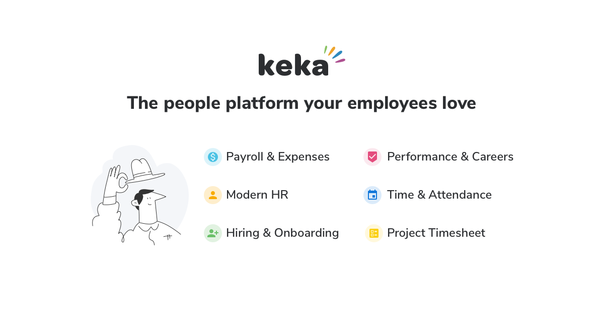

<div align="left">

[](https://keka.com)

# [Keka hr](https://keka.com)

Here's our story,

It all began with the frustration of using software that sucks. Prior to starting Keka, our core team was a 100 person business that needed an easy to use software for managing employees. We looked everywhere and all we found were software that was lousy and hard to use. We felt SME businesses in India deserved something better. Something awesome actually!

Thus emerged Keka!

</div>

## Requirements

Building the API client library requires:

1. Java 1.8+
2. Maven (3.8.3+)/Gradle (7.2+)

If you are adding this library to an Android Application or Library:

3. Android 8.0+ (API Level 26+)

## Installation<a id="installation"></a>
<div align="center">
  <a href="https://konfigthis.com/sdk-sign-up?company=Keka%20HR&language=Java">
    
  </a>
</div>

### Maven users

Add this dependency to your project's POM:

```xml
<dependency>
  <groupId>com.konfigthis</groupId>
  <artifactId>keka-hr-java-sdk</artifactId>
  <version>v1</version>
  <scope>compile</scope>
</dependency>
```

### Gradle users

Add this dependency to your `build.gradle`:

```groovy
// build.gradle
repositories {
  mavenCentral()
}

dependencies {
   implementation "com.konfigthis:keka-hr-java-sdk:v1"
}
```

### Android users

Make sure your `build.gradle` file as a `minSdk` version of at least 26:
```groovy
// build.gradle
android {
    defaultConfig {
        minSdk 26
    }
}
```

Also make sure your library or application has internet permissions in your `AndroidManifest.xml`:

```xml
<!--AndroidManifest.xml-->
<?xml version="1.0" encoding="utf-8"?>
<manifest xmlns:android="http://schemas.android.com/apk/res/android"
    xmlns:tools="http://schemas.android.com/tools">
    <uses-permission android:name="android.permission.INTERNET"/>
</manifest>
```

### Others

At first generate the JAR by executing:

```shell
mvn clean package
```

Then manually install the following JARs:

* `target/keka-hr-java-sdk-v1.jar`
* `target/lib/*.jar`

## Getting Started

Please follow the [installation](#installation) instruction and execute the following Java code:

```java
import com.konfigthis.client.ApiClient;
import com.konfigthis.client.ApiException;
import com.konfigthis.client.ApiResponse;
import com.konfigthis.client.KekaHr;
import com.konfigthis.client.Configuration;
import com.konfigthis.client.auth.*;
import com.konfigthis.client.model.*;
import com.konfigthis.client.api.AssetApi;
import java.util.List;
import java.util.Map;
import java.util.UUID;

public class Example {
  public static void main(String[] args) {
    Configuration configuration = new Configuration();
    configuration.host = "https://.keka.com/api/v1";
    
    // Configure OAuth2 access token for authorization: oauth2
    configuration.accessToken = "YOUR ACCESS TOKEN";
    
    KekaHr client = new KekaHr(configuration);
    String assetIds = "assetIds_example"; // The asset ids.
    String employeeIds = "employeeIds_example"; // The employee ids.
    String assetStatus = "assetStatus_example"; // The asset status.
    OffsetDateTime lastModified = OffsetDateTime.now(); // The last modified.
    Integer pageNumber = 56;
    Integer pageSize = 56; // Represents how many results you'd like to retrieve per request (page). Default is 100. Max is 200
    try {
      AssetPagedResponse result = client
              .asset
              .getAll()
              .assetIds(assetIds)
              .employeeIds(employeeIds)
              .assetStatus(assetStatus)
              .lastModified(lastModified)
              .pageNumber(pageNumber)
              .pageSize(pageSize)
              .execute();
      System.out.println(result);
      System.out.println(result.getSucceeded());
      System.out.println(result.getMessage());
      System.out.println(result.getErrors());
      System.out.println(result.getData());
      System.out.println(result.getPageNumber());
      System.out.println(result.getPageSize());
      System.out.println(result.getFirstPage());
      System.out.println(result.getLastPage());
      System.out.println(result.getTotalPages());
      System.out.println(result.getTotalRecords());
      System.out.println(result.getNextPage());
      System.out.println(result.getPreviousPage());
    } catch (ApiException e) {
      System.err.println("Exception when calling AssetApi#getAll");
      System.err.println("Status code: " + e.getStatusCode());
      System.err.println("Reason: " + e.getResponseBody());
      System.err.println("Response headers: " + e.getResponseHeaders());
      e.printStackTrace();
    }

    // Use .executeWithHttpInfo() to retrieve HTTP Status Code, Headers and Request
    try {
      ApiResponse<AssetPagedResponse> response = client
              .asset
              .getAll()
              .assetIds(assetIds)
              .employeeIds(employeeIds)
              .assetStatus(assetStatus)
              .lastModified(lastModified)
              .pageNumber(pageNumber)
              .pageSize(pageSize)
              .executeWithHttpInfo();
      System.out.println(response.getResponseBody());
      System.out.println(response.getResponseHeaders());
      System.out.println(response.getStatusCode());
      System.out.println(response.getRoundTripTime());
      System.out.println(response.getRequest());
    } catch (ApiException e) {
      System.err.println("Exception when calling AssetApi#getAll");
      System.err.println("Status code: " + e.getStatusCode());
      System.err.println("Reason: " + e.getResponseBody());
      System.err.println("Response headers: " + e.getResponseHeaders());
      e.printStackTrace();
    }
  }
}

```

## Documentation for API Endpoints

All URIs are relative to *https://.keka.com/api/v1*

Class | Method | HTTP request | Description
------------ | ------------- | ------------- | -------------
*AssetApi* | [**getAll**](docs/AssetApi.md#getAll) | **GET** /assets | Get all Assets
*AssetCategoryApi* | [**getAll**](docs/AssetCategoryApi.md#getAll) | **GET** /assets/categories | Get all Asset Categories
*AssetConditionApi* | [**getAll**](docs/AssetConditionApi.md#getAll) | **GET** /assets/conditions | Get all Asset Conditions
*AssetTypeApi* | [**getAll**](docs/AssetTypeApi.md#getAll) | **GET** /assets/types | Get all Asset Types
*AttendanceApi* | [**getRecordsInRange**](docs/AttendanceApi.md#getRecordsInRange) | **GET** /time/attendance | Get all Attendance Records
*AttendanceCaptureSchemeApi* | [**getAll**](docs/AttendanceCaptureSchemeApi.md#getAll) | **GET** /time/capturescheme | Get all captureschemes
*AuthenticationApi* | [**getAccessToken**](docs/AuthenticationApi.md#getAccessToken) | **POST** /connect/token | Generate Access Token
*BadgeApi* | [**getList**](docs/BadgeApi.md#getList) | **GET** /pms/badges | Gets badge list.
*ClientsApi* | [**createClientIdentifier**](docs/ClientsApi.md#createClientIdentifier) | **POST** /psa/clients | Create a Client
*ClientsApi* | [**getAll**](docs/ClientsApi.md#getAll) | **GET** /psa/clients | Get all clients
*ClientsApi* | [**getById**](docs/ClientsApi.md#getById) | **GET** /psa/clients/{id} | Get a client
*ClientsApi* | [**updateDetails**](docs/ClientsApi.md#updateDetails) | **PUT** /psa/clients/{id} | Update a Client
*CurrencyApi* | [**getAll**](docs/CurrencyApi.md#getAll) | **GET** /hris/currencies | Get all currencies
*DepartmentsApi* | [**getAll**](docs/DepartmentsApi.md#getAll) | **GET** /hris/departments | Get all departments
*EmployeesApi* | [**createEmployee**](docs/EmployeesApi.md#createEmployee) | **POST** /hris/employees | Create an Employee
*EmployeesApi* | [**getAll**](docs/EmployeesApi.md#getAll) | **GET** /hris/employees | Get all Employees
*EmployeesApi* | [**getAllUpdateFields**](docs/EmployeesApi.md#getAllUpdateFields) | **GET** /hris/employees/updatefields | Get all update fields
*EmployeesApi* | [**getById**](docs/EmployeesApi.md#getById) | **GET** /hris/employees/{id} | Get an Employee
*EmployeesApi* | [**updateJobDetails**](docs/EmployeesApi.md#updateJobDetails) | **PUT** /hris/employees/{id}/jobdetails | Update employee job details
*EmployeesApi* | [**updatePersonalDetails**](docs/EmployeesApi.md#updatePersonalDetails) | **PUT** /hris/employees/{id}/personaldetails | Update Employee personal details
*ExpenseApi* | [**getAllClaims**](docs/ExpenseApi.md#getAllClaims) | **GET** /expense/claims | Get all Expense Claims
*ExpenseCategoryApi* | [**getAllCategories**](docs/ExpenseCategoryApi.md#getAllCategories) | **GET** /expense/categories | Get all Expense Categories
*ExpensePolicyApi* | [**listAllExpensePolicies**](docs/ExpensePolicyApi.md#listAllExpensePolicies) | **GET** /expensepolicies | Get all expensepolicies
*GoalApi* | [**listWithHierarchy**](docs/GoalApi.md#listWithHierarchy) | **GET** /pms/goals | Gets goal list.
*GoalApi* | [**updateProgress**](docs/GoalApi.md#updateProgress) | **PUT** /pms/goals/{goalId}/progress | Update goal progress
*GroupsApi* | [**getAll**](docs/GroupsApi.md#getAll) | **GET** /hris/groups | Get all Groups
*GroupsApi* | [**getAllGroupTypes**](docs/GroupsApi.md#getAllGroupTypes) | **GET** /hris/grouptypes | Get all Group Types
*HolidayCalendarApi* | [**getAllHolidaysCalendar**](docs/HolidayCalendarApi.md#getAllHolidaysCalendar) | **GET** /time/holidayscalendar | Get all holidays Calendar
*JobTitleApi* | [**getAll**](docs/JobTitleApi.md#getAll) | **GET** /hris/jobtitles | Get all jobtitles
*JobsApi* | [**addCandidateNote**](docs/JobsApi.md#addCandidateNote) | **POST** /v1/hire/jobs/{jobId}/candidate/{candidateId}/notes | Adds candidate note
*JobsApi* | [**getAllPublishedJobs**](docs/JobsApi.md#getAllPublishedJobs) | **GET** /v1/hire/jobs | Get all jobs
*JobsApi* | [**getApplicationFields**](docs/JobsApi.md#getApplicationFields) | **GET** /v1/hire/jobs/{jobId}/applicationfields | Get application fields
*JobsApi* | [**getCandidateInterviews**](docs/JobsApi.md#getCandidateInterviews) | **GET** /v1/hire/jobs/{jobId}/candidate/{candidateId}/interviews | Get interview scheduled and completed for a job candidate
*JobsApi* | [**getCandidateScorecards**](docs/JobsApi.md#getCandidateScorecards) | **GET** /v1/hire/jobs/{jobId}/candidate/{candidateId}/scorecards | Get scorecard of a specified candidate for a job candidate
*JobsApi* | [**getCandidates**](docs/JobsApi.md#getCandidates) | **GET** /v1/hire/jobs/{jobId}/candidates | Get job candidates
*JobsApi* | [**postCandidate**](docs/JobsApi.md#postCandidate) | **POST** /v1/hire/jobs/{jobId}/candidate | Post a job candidate
*JobsApi* | [**updateCandidate**](docs/JobsApi.md#updateCandidate) | **PUT** /v1/hire/jobs/{jobId}/candidate/{candidateId} | Updated a candidate
*LeaveBalanceApi* | [**getAllBalances**](docs/LeaveBalanceApi.md#getAllBalances) | **GET** /time/leavebalance | Get all Leave balances
*LeaveRequestsApi* | [**createRequestIdentifier**](docs/LeaveRequestsApi.md#createRequestIdentifier) | **POST** /time/leaverequests | Create an Leave Request
*LeaveRequestsApi* | [**getAllBetweenDates**](docs/LeaveRequestsApi.md#getAllBetweenDates) | **GET** /time/leaverequests | Get all Leave Requests
*LeaveTypesApi* | [**listAll**](docs/LeaveTypesApi.md#listAll) | **GET** /time/leavetypes | Get all Leave Types
*LocationsApi* | [**getAll**](docs/LocationsApi.md#getAll) | **GET** /hris/locations | Get all Locations
*NoticePeriodApi* | [**getAll**](docs/NoticePeriodApi.md#getAll) | **GET** /hris/noticeperiods | Get all noticeperiods
*PayBandsApi* | [**getAll**](docs/PayBandsApi.md#getAll) | **GET** /payroll/paybands | Get all Pay Bands
*PayCyclesApi* | [**getAll**](docs/PayCyclesApi.md#getAll) | **GET** /payroll/paygroups/{payGroupId}/paycycles | Get all Pay Cycles
*PayCyclesApi* | [**getBatchPayments**](docs/PayCyclesApi.md#getBatchPayments) | **GET** /payroll/paygroups/{payGroupId}/paycycles/{payCycleId}/paybatches/{payBatchId}/payments | Get all Batch Payments
*PayCyclesApi* | [**getPayBatches**](docs/PayCyclesApi.md#getPayBatches) | **GET** /payroll/paygroups/{payGroupId}/paycycles/{payCycleId}/paybatches | Get all Pay Batches
*PayCyclesApi* | [**getPayRegister**](docs/PayCyclesApi.md#getPayRegister) | **GET** /payroll/paygroups/{payGroupId}/paycycles/{payCycleId}/payregister | Get Pay Register
*PayCyclesApi* | [**updatePaymentsStatus**](docs/PayCyclesApi.md#updatePaymentsStatus) | **PUT** /payroll/paygroups/{payGroupId}/paycycles/{payCycleId}/paybatches/{payBatchId}/payments | Update the Payments status
*PayGradesApi* | [**getAll**](docs/PayGradesApi.md#getAll) | **GET** /payroll/paygrades | Get all Pay Grades
*PayGroupsApi* | [**getAll**](docs/PayGroupsApi.md#getAll) | **GET** /payroll/paygroups | Get all Pay Groups
*PraiseApi* | [**createPraiseIdentifier**](docs/PraiseApi.md#createPraiseIdentifier) | **POST** /pms/praise | Add Praise
*PraiseApi* | [**listEmployeesPraises**](docs/PraiseApi.md#listEmployeesPraises) | **GET** /pms/praise | Gets praise list.
*ProjectPhasesApi* | [**createPhaseIdentifier**](docs/ProjectPhasesApi.md#createPhaseIdentifier) | **POST** /psa/projects/{projectId}/phases | Create a Project Phase
*ProjectPhasesApi* | [**getAll**](docs/ProjectPhasesApi.md#getAll) | **GET** /psa/projects/{projectId}/phases | Get project phases.
*ProjectsApi* | [**createProjectIdentifier**](docs/ProjectsApi.md#createProjectIdentifier) | **POST** /psa/projects | Create a Project
*ProjectsApi* | [**getAll**](docs/ProjectsApi.md#getAll) | **GET** /psa/projects | Get all projects.
*ProjectsApi* | [**getAllocations**](docs/ProjectsApi.md#getAllocations) | **GET** /psa/projects/{id}/allocations | Get a project allocations
*ProjectsApi* | [**getById**](docs/ProjectsApi.md#getById) | **GET** /psa/projects/{id} | Get a project
*ProjectsApi* | [**getTimesheetEntriesBetweenDates**](docs/ProjectsApi.md#getTimesheetEntriesBetweenDates) | **GET** /psa/projects/{id}/timeentries | Get project timesheet entries.
*ProjectsApi* | [**updateDetails**](docs/ProjectsApi.md#updateDetails) | **PUT** /psa/projects/{id} | Update a Project
*RequisitionRequestApi* | [**getAll**](docs/RequisitionRequestApi.md#getAll) | **GET** /requisition/requests | Get all Requisition Requests
*SalaryComponentsApi* | [**getAllComponents**](docs/SalaryComponentsApi.md#getAllComponents) | **GET** /payroll/salarycomponents | Get all Salary Components
*TalentPoolApi* | [**addCandidate**](docs/TalentPoolApi.md#addCandidate) | **POST** /v1/hire/talentpool/{talentPoolId}/candidate | Post a candidate to a talent pool
*TalentPoolApi* | [**getAll**](docs/TalentPoolApi.md#getAll) | **GET** /v1/hire/talentpool | Get all Talent pools
*TalentPoolApi* | [**getApplicationFields**](docs/TalentPoolApi.md#getApplicationFields) | **GET** /v1/hire/talentpool/{talentPoolId}/applicationfields | Get Talent pool application fields
*TalentPoolApi* | [**getCandidates**](docs/TalentPoolApi.md#getCandidates) | **GET** /v1/hire/talentpool/{talentPoolId}/candidates | Get Talent pool candidates
*TasksApi* | [**createTaskIdentifier**](docs/TasksApi.md#createTaskIdentifier) | **POST** /psa/projects/{projectId}/tasks | Create a task
*TasksApi* | [**getAll**](docs/TasksApi.md#getAll) | **GET** /psa/projects/{projectId}/tasks | Get project tasks.
*TasksApi* | [**listTimeEntriesBetweenDates**](docs/TasksApi.md#listTimeEntriesBetweenDates) | **GET** /psa/projects/{projectId}/tasks/{taskId}/timeentries | Get project task time entries.
*TasksApi* | [**updateTask**](docs/TasksApi.md#updateTask) | **PUT** /psa/projects/{projectId}/tasks/{taskId} | Update a task
*TimeFramesApi* | [**getAll**](docs/TimeFramesApi.md#getAll) | **GET** /pms/timeframes | Gets time frame list.
*TimesheetEntriesApi* | [**getBetweenDates**](docs/TimesheetEntriesApi.md#getBetweenDates) | **GET** /psa/timeentries | Get project timesheet entries.


## Documentation for Models

 - [APIBadge](docs/APIBadge.md)
 - [APIBadgeLookup](docs/APIBadgeLookup.md)
 - [APIBadgePagedResponse](docs/APIBadgePagedResponse.md)
 - [APIBaseGoal](docs/APIBaseGoal.md)
 - [APIClientContact](docs/APIClientContact.md)
 - [APIClientPagedResponse](docs/APIClientPagedResponse.md)
 - [APIClientResponse](docs/APIClientResponse.md)
 - [APIDepartmentView](docs/APIDepartmentView.md)
 - [APIDepartmentViewPagedResponse](docs/APIDepartmentViewPagedResponse.md)
 - [APIEmployeeLookup](docs/APIEmployeeLookup.md)
 - [APIEmployeeReview](docs/APIEmployeeReview.md)
 - [APIEmployeeReviewPagedResponse](docs/APIEmployeeReviewPagedResponse.md)
 - [APIEmployeeSalary](docs/APIEmployeeSalary.md)
 - [APIEmployeeSalaryComponent](docs/APIEmployeeSalaryComponent.md)
 - [APIEmployeeSalaryPagedResponse](docs/APIEmployeeSalaryPagedResponse.md)
 - [APIGoal](docs/APIGoal.md)
 - [APIGoalPagedResponse](docs/APIGoalPagedResponse.md)
 - [APILookup](docs/APILookup.md)
 - [APIPayCycleView](docs/APIPayCycleView.md)
 - [APIPayCycleViewPagedResponse](docs/APIPayCycleViewPagedResponse.md)
 - [APIPayGroupView](docs/APIPayGroupView.md)
 - [APIPayGroupViewPagedResponse](docs/APIPayGroupViewPagedResponse.md)
 - [APIPayRegisterView](docs/APIPayRegisterView.md)
 - [APIPayRegisterViewPagedResponse](docs/APIPayRegisterViewPagedResponse.md)
 - [APIPraise](docs/APIPraise.md)
 - [APIPraisePagedResponse](docs/APIPraisePagedResponse.md)
 - [APIProject](docs/APIProject.md)
 - [APIProjectAllocation](docs/APIProjectAllocation.md)
 - [APIProjectAllocationPagedResponse](docs/APIProjectAllocationPagedResponse.md)
 - [APIProjectPagedResponse](docs/APIProjectPagedResponse.md)
 - [APIProjectResponse](docs/APIProjectResponse.md)
 - [APIProjectTask](docs/APIProjectTask.md)
 - [APIProjectTaskPagedResponse](docs/APIProjectTaskPagedResponse.md)
 - [APIReviewCycle](docs/APIReviewCycle.md)
 - [APIReviewCycleLookup](docs/APIReviewCycleLookup.md)
 - [APIReviewCyclePagedResponse](docs/APIReviewCyclePagedResponse.md)
 - [APIReviewGroup](docs/APIReviewGroup.md)
 - [APIReviewGroupLookup](docs/APIReviewGroupLookup.md)
 - [APIReviewGroupPagedResponse](docs/APIReviewGroupPagedResponse.md)
 - [APIReviewRating](docs/APIReviewRating.md)
 - [APISalaryComponent](docs/APISalaryComponent.md)
 - [APISalaryComponentPagedResponse](docs/APISalaryComponentPagedResponse.md)
 - [APITimeFrame](docs/APITimeFrame.md)
 - [APITimeFramePagedResponse](docs/APITimeFramePagedResponse.md)
 - [APITimesheetEntry](docs/APITimesheetEntry.md)
 - [APITimesheetEntryPagedResponse](docs/APITimesheetEntryPagedResponse.md)
 - [APIUpdateGoalProgress](docs/APIUpdateGoalProgress.md)
 - [AccountStatus](docs/AccountStatus.md)
 - [AddPraise](docs/AddPraise.md)
 - [Address](docs/Address.md)
 - [ApiLookup](docs/ApiLookup.md)
 - [ApiLookupPagedResponse](docs/ApiLookupPagedResponse.md)
 - [ApplicationStatus](docs/ApplicationStatus.md)
 - [Asset](docs/Asset.md)
 - [AssetPagedResponse](docs/AssetPagedResponse.md)
 - [AssetStatus](docs/AssetStatus.md)
 - [AttendanceDayType](docs/AttendanceDayType.md)
 - [AttendanceSummary](docs/AttendanceSummary.md)
 - [AttendanceSummaryPagedResponse](docs/AttendanceSummaryPagedResponse.md)
 - [AttendanceTimeEntry](docs/AttendanceTimeEntry.md)
 - [AuthenticationGetAccessTokenRequest](docs/AuthenticationGetAccessTokenRequest.md)
 - [AuthenticationGetAccessTokenResponse](docs/AuthenticationGetAccessTokenResponse.md)
 - [BadgeStatus](docs/BadgeStatus.md)
 - [Batch](docs/Batch.md)
 - [BatchPagedResponse](docs/BatchPagedResponse.md)
 - [BillingInfo](docs/BillingInfo.md)
 - [BillingRateLookup](docs/BillingRateLookup.md)
 - [BillingRateUnit](docs/BillingRateUnit.md)
 - [BloodGroup](docs/BloodGroup.md)
 - [BooleanResponse](docs/BooleanResponse.md)
 - [CandidateNoteDTO](docs/CandidateNoteDTO.md)
 - [Client](docs/Client.md)
 - [ContingentType](docs/ContingentType.md)
 - [Currency](docs/Currency.md)
 - [CurrencyPagedResponse](docs/CurrencyPagedResponse.md)
 - [CustomField](docs/CustomField.md)
 - [CustomFormField](docs/CustomFormField.md)
 - [Education](docs/Education.md)
 - [EducationDTO](docs/EducationDTO.md)
 - [Employee](docs/Employee.md)
 - [EmployeeField](docs/EmployeeField.md)
 - [EmployeeFieldResponse](docs/EmployeeFieldResponse.md)
 - [EmployeeLeaveBalanceListItem](docs/EmployeeLeaveBalanceListItem.md)
 - [EmployeeLeaveBalanceListItemPagedResponse](docs/EmployeeLeaveBalanceListItemPagedResponse.md)
 - [EmployeeLookup](docs/EmployeeLookup.md)
 - [EmployeePayment](docs/EmployeePayment.md)
 - [EmployeePaymentPagedResponse](docs/EmployeePaymentPagedResponse.md)
 - [EmployeePayrollCycleRunStatus](docs/EmployeePayrollCycleRunStatus.md)
 - [EmployeeProfile](docs/EmployeeProfile.md)
 - [EmployeeProfilePagedResponse](docs/EmployeeProfilePagedResponse.md)
 - [EmployeeProfileResponse](docs/EmployeeProfileResponse.md)
 - [EmploymentStatus](docs/EmploymentStatus.md)
 - [ErrorDetail](docs/ErrorDetail.md)
 - [ExitStatus](docs/ExitStatus.md)
 - [ExitType](docs/ExitType.md)
 - [Expense](docs/Expense.md)
 - [ExpenseCategory](docs/ExpenseCategory.md)
 - [ExpenseCategoryPagedResponse](docs/ExpenseCategoryPagedResponse.md)
 - [ExpenseClaim](docs/ExpenseClaim.md)
 - [ExpenseClaimApprovalStatus](docs/ExpenseClaimApprovalStatus.md)
 - [ExpenseClaimPagedResponse](docs/ExpenseClaimPagedResponse.md)
 - [ExpenseType](docs/ExpenseType.md)
 - [Experience](docs/Experience.md)
 - [ExperienceDTO](docs/ExperienceDTO.md)
 - [FieldChoice](docs/FieldChoice.md)
 - [FieldItem](docs/FieldItem.md)
 - [FieldOptionDTO](docs/FieldOptionDTO.md)
 - [FieldType](docs/FieldType.md)
 - [FilterFieldType](docs/FilterFieldType.md)
 - [FilterValue](docs/FilterValue.md)
 - [FilteringOptions](docs/FilteringOptions.md)
 - [Frequency](docs/Frequency.md)
 - [Gender](docs/Gender.md)
 - [GoalMetricType](docs/GoalMetricType.md)
 - [GoalStatus](docs/GoalStatus.md)
 - [GoalType](docs/GoalType.md)
 - [Group](docs/Group.md)
 - [GroupLookup](docs/GroupLookup.md)
 - [GroupPagedResponse](docs/GroupPagedResponse.md)
 - [GroupType](docs/GroupType.md)
 - [GroupTypePagedResponse](docs/GroupTypePagedResponse.md)
 - [HiringTeamDTO](docs/HiringTeamDTO.md)
 - [Image](docs/Image.md)
 - [InterviewDTO](docs/InterviewDTO.md)
 - [InvitationStatus](docs/InvitationStatus.md)
 - [JobApplicationDetailsDTO](docs/JobApplicationDetailsDTO.md)
 - [JobApplicationFieldsDTO](docs/JobApplicationFieldsDTO.md)
 - [JobCandidateDetailsDTO](docs/JobCandidateDetailsDTO.md)
 - [JobCustomFieldDTO](docs/JobCustomFieldDTO.md)
 - [JobDTO](docs/JobDTO.md)
 - [JobDetailsUpdateRequest](docs/JobDetailsUpdateRequest.md)
 - [JobRecruiterType](docs/JobRecruiterType.md)
 - [JobStatus](docs/JobStatus.md)
 - [JobTitle](docs/JobTitle.md)
 - [JobTitlePagedResponse](docs/JobTitlePagedResponse.md)
 - [JobType](docs/JobType.md)
 - [LeaveBalanceListItem](docs/LeaveBalanceListItem.md)
 - [LeaveDayStatus](docs/LeaveDayStatus.md)
 - [LeaveRequest](docs/LeaveRequest.md)
 - [LeaveRequestPagedResponse](docs/LeaveRequestPagedResponse.md)
 - [LeaveRequestStatus](docs/LeaveRequestStatus.md)
 - [LeaveType](docs/LeaveType.md)
 - [LeaveTypePagedResponse](docs/LeaveTypePagedResponse.md)
 - [LeaveTypeSelection](docs/LeaveTypeSelection.md)
 - [LeaveTypeStats](docs/LeaveTypeStats.md)
 - [LeaveTypeStatsListResponse](docs/LeaveTypeStatsListResponse.md)
 - [Location](docs/Location.md)
 - [LocationDTO](docs/LocationDTO.md)
 - [LocationPagedResponse](docs/LocationPagedResponse.md)
 - [LookupInfo](docs/LookupInfo.md)
 - [MaritalStatus](docs/MaritalStatus.md)
 - [ModelAPIClient](docs/ModelAPIClient.md)
 - [PSACustomField](docs/PSACustomField.md)
 - [PagingOptions](docs/PagingOptions.md)
 - [PayItemView](docs/PayItemView.md)
 - [PaymentStatus](docs/PaymentStatus.md)
 - [PaymentTransaction](docs/PaymentTransaction.md)
 - [PayrollRunStatus](docs/PayrollRunStatus.md)
 - [PersonalDetailsUpdateRequest](docs/PersonalDetailsUpdateRequest.md)
 - [PostLeaveRequest](docs/PostLeaveRequest.md)
 - [Project](docs/Project.md)
 - [ProjectPhase](docs/ProjectPhase.md)
 - [ProjectPhasePagedResponse](docs/ProjectPhasePagedResponse.md)
 - [ProjectStatus](docs/ProjectStatus.md)
 - [ProjectTask](docs/ProjectTask.md)
 - [QueryOptions](docs/QueryOptions.md)
 - [Relation](docs/Relation.md)
 - [RelationType](docs/RelationType.md)
 - [RemunerationType](docs/RemunerationType.md)
 - [ReplacementEmployee](docs/ReplacementEmployee.md)
 - [ReplacementReason](docs/ReplacementReason.md)
 - [RequisitionReplacementEmployee](docs/RequisitionReplacementEmployee.md)
 - [RequisitionRequest](docs/RequisitionRequest.md)
 - [RequisitionRequestPagedResponse](docs/RequisitionRequestPagedResponse.md)
 - [RequisitionRequestStatus](docs/RequisitionRequestStatus.md)
 - [ReviewGroupCycleStatus](docs/ReviewGroupCycleStatus.md)
 - [ReviewStatus](docs/ReviewStatus.md)
 - [ScoreCardDTO](docs/ScoreCardDTO.md)
 - [ScorecardSectionDTO](docs/ScorecardSectionDTO.md)
 - [SessionType](docs/SessionType.md)
 - [SortingOptions](docs/SortingOptions.md)
 - [StringResponse](docs/StringResponse.md)
 - [StringStringValuesKeyValuePair](docs/StringStringValuesKeyValuePair.md)
 - [SystemGroupType](docs/SystemGroupType.md)
 - [Tag](docs/Tag.md)
 - [TalentPoolApplicationFieldsDTO](docs/TalentPoolApplicationFieldsDTO.md)
 - [TalentPoolCandidateDTO](docs/TalentPoolCandidateDTO.md)
 - [TalentPoolDTO](docs/TalentPoolDTO.md)
 - [TaskBillingType](docs/TaskBillingType.md)
 - [TaskType](docs/TaskType.md)
 - [TimeDTO](docs/TimeDTO.md)
 - [TimeDuration](docs/TimeDuration.md)
 - [TimeEntryStatus](docs/TimeEntryStatus.md)
 - [TimeFrameStatus](docs/TimeFrameStatus.md)
 - [TimePeriod](docs/TimePeriod.md)
 - [TimeType](docs/TimeType.md)
 - [UpdateClient](docs/UpdateClient.md)
 - [UpdateProject](docs/UpdateProject.md)
 - [UpdateProjectTask](docs/UpdateProjectTask.md)
 - [WorkerType](docs/WorkerType.md)


## Author
This Java package is automatically generated by [Konfig](https://konfigthis.com)
